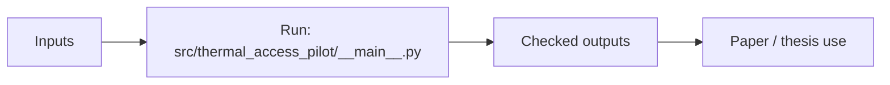

# thermal_access_pilot

Heat-aware walking access and service routing pilot.

## Scheme



## Main Result


## Run

Entrypoint: `src/thermal_access_pilot/__main__.py`

Human:

```bash
uv run thermal-access-pilot --config configs/kaliningrad.toml --force
```

Agent:

Inspect maps, parquet row counts, and summary JSON after each run.

## Publication

No standalone publication yet; thesis integration in parent repo.

## Next Steps / Heuristics

Heuristic: heat-only UTCI path is current scope; wind/URock/PALM are deferred until validated.
