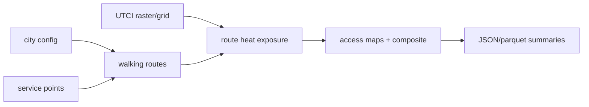
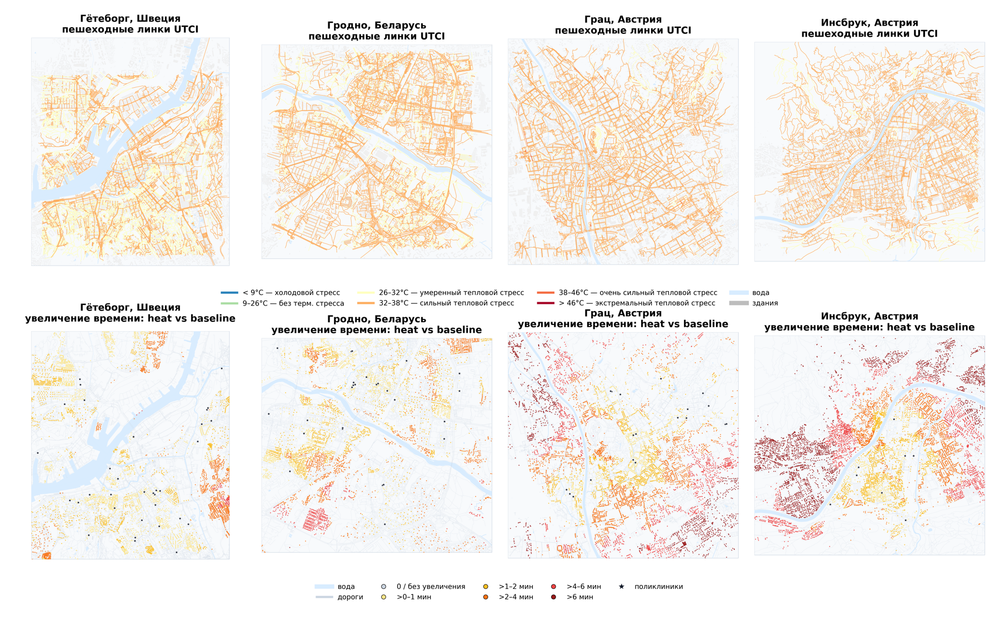

# thermal_access_pilot

Heat-aware walking access pilot. It combines service locations, pedestrian routes, and UTCI/heat exposure to compare normal and hottest-period accessibility.

## System Map



## Main Result



## Run

Entrypoint: `src/thermal_access_pilot/__main__.py`

Human:

```bash
uv run thermal-access-pilot --config configs/kaliningrad.toml --force
```

Agent: inspect maps, parquet row counts, and summary JSON after each run; do not infer visibility from render logs.

## Publication

No standalone publication yet; thesis integration is in the parent repo.

## Next Steps / Heuristics

Heuristic: heat-only UTCI is the current validated scope. Wind/URock/PALM expansion is deferred until those layers are validated.
